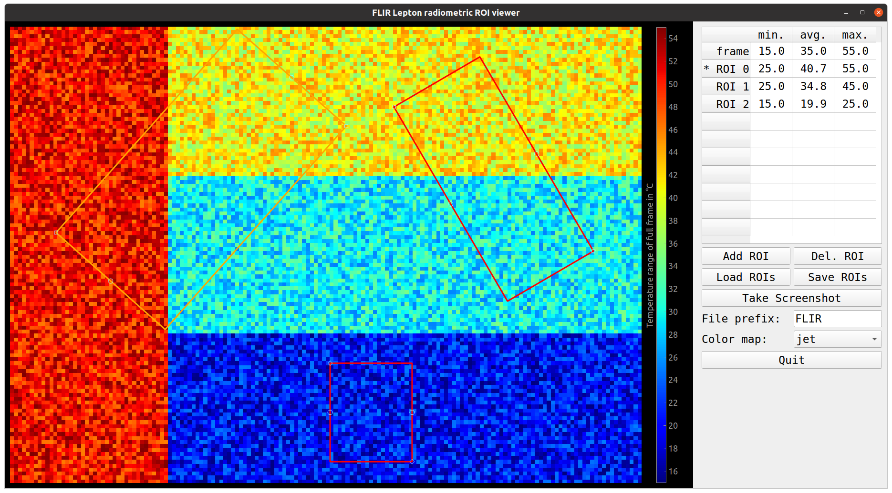

## Radiometric Region of Interest (ROI) viewer for FLIR Lepton thermal cameras

Developed & tested with a Lepton 3.5 mounted on PureThermal3 USB-C board (www.groupgets.com).

Using pyQt 5 and pyQTgraph as GUI toolkit.

### Features
- Radiometric data processing, display using selectable color maps
- up to 10 rectangular ROIs (draggable by mouse, rotatable & scalable via small handles)  
   - add ROI via button, delete via right click on ROI or button (last ROI is deleted)
- min/max & average temperatures displayed in table for full frame and each ROI
- screenshot capture (via GUI button or TCP client, default port 8123)
- reports temperature data to TCP client in JSON format
- load/store ROI configurations and screenshot folder to YAML config file
- simulated frame data (4 temp. zones with noise) if USB device is not present

### Screenshot


(Simulation mode is shown: test pattern with four different temperature zones plus noise. Three ROI rectangles, one is highlighted.)

### Requirements
- pyQtGraph: https://github.com/pyqtgraph/pyqtgraph#installation-methods
- modified libuvc, [installation notes below](#compilation-of-libuvc)

### Usage

```
$ git clone https://github.com/ozel/FLIR_ROI_Viewer.git
$ cd FLIR_ROI_Viewer
$ python3 main.py

# testing TCP remote control feature in a separate terminal
# for each sent message (here 'test'), a screenshot is taken with that file name prefix
# and a JSON string with all temperatures (full frame and ROIs) is returned
$ nc localhost 8123
test 
{
 "file name": "screenshots/test_2024-02-20_15-52-27_heatmap.tiff",
 "frame": {
  "min.": 15.0,
  "avg.": 35.0,
  "max.": 55.0
 },
 "ROI 0": {
  "min.": 25.0,
  "avg.": 40.6,
  "max.": 55.0
 },
 "ROI 1": {
  "min.": 25.0,
  "avg.": 35.2,
  "max.": 45.0
 },
 "ROI 2": {
  "min.": 15.0,
  "avg.": 20.0,
  "max.": 25.0
 }
}
```


### Hardware

A 3D-printed holder for the PureThermal3 USB-C board is located inside the [hardware](./hardware/) folder.
It was designed for attaching the camera to the lens of a microscope inside a wafer proper. 

### References & Copyright

Further notes and implementation details are commented in [ROIviewer.py](./ROIviewer.py).
Reading of raw frame data via libuvc (using [uvctypes.py](./uvctypes.py)) follows 
the example of the PureThermal manufacturer: https://github.com/groupgets/purethermal1-uvc-capture/blob/master/python/

Author: Oliver Keller (GSI/FAIR), o.keller [at] gsi.de, 2023-2024
Released as open source under the permissive [BSD 2-Clause License](./LICENSE).


----

### General Info on Programming FLIR Cameras

The FLIR Lepton/Boson thermal camera modules have been available for years from www.groupgets.com. 
Still, the information about programming & using them is somewhat spread out and often outdated. 
I've compiled here the information that I gathered in winter 2023/2024 and that is relevant for using 
the Lepton 3.5 in radiometric mode via USB.

The PureThermal3 USB board emulates a webcam device via the USB device class UVC (USB Video Class).
Any modern OS like Linux has standard kernel drivers for this, but a modified version of libuvc is needed 
to deal with the custom data format of the pixels. 
In general, there is little example code for the radiometric feature via USB and on python.
For example, [pylepton](https://github.com/groupgets/pylepton) only supports the SPI interface.

#### Main Online Ressources for Radometric Applications using USB

- GUI program in C++/Qt, supports radiometric mode:  
    - https://github.com/groupgets/GetThermal
    - binary AppImage works on Ubuntu 20.04 LTS: https://github.com/groupgets/GetThermal/releases/tag/v0.1.4

- forked version of libuvc modified for use with PureThermal USB boards:
    https://github.com/groupgets/libuvc

- python scripts for PureThermal image capture vis USB and further details on using UVC-compatible linux tools:
    https://github.com/groupgets/purethermal1-uvc-capture

- OPENMV, for complex machine vision, e.g. object tracking by temperature:
    https://github.com/openmv/openmv/tree/master/scripts/examples/01-Camera/05-FLIR-Lepton

#### Udev Rules for Linux
allows USB access on Linux as regular non-root user

create /etc/udev/rules.d/99-purethermal.rules with content:
~~~
#UVC cameras
SUBSYSTEMS=="usb", ATTRS{idVendor}=="1e4e", ATTRS{idProduct}=="0100", MODE="0666"
~~~

Create usb group and add desired user name
~~~
$ sudo groupadd -r usb
$ sudo usermod -a -G usb <user name>
~~~

#### Compilation of libuvc
Tested on Ubtuntu 20.04 LTS
Requirements:
~~~
$ sudo apt-get install libusb-1.0-0-dev
$ sudo apt-get install python3-opencv
~~~

Compile custom libuvc:
~~~
git clone https://github.com/groupgets/libuvc
cd libuvc
mkdir build
cd build
cmake ..
make && sudo make install
~~~
Notes: 
- CMAKE will complain about missing JPEG library (even if libjpeg-dev is installed!)
    => this can be safely ignored
- libuvc.so will be installed into /usr/local/lib
- add /usr/local/lib permanently to LD_LIBRARY_PATH via ldconfig:
  ~~~
  $ sudo echo "/usr/local/lib" > /etc/ld.so.conf.d/usr-local.conf
  $ ldconfig
  ~~~ 

#### Emissivity

Adjusting the 'scene emissivity' would help measure very reflective surfaces. 
The default emissivity is set for rough surfaces of low reflectivity. 
It seems the [Lepton SDK](https://github.com/groupgets/GetThermal/blob/890d21707642eb2ede9ede4d18012cfb81ccf74e/lepton_sdk/Inc/LEPTON_RAD.h#L262) allows to access and modifiy the internal parameters that control calculation of the temperature values.

- [FLIR Lepton Engineering Datasheet](https://flir.netx.net/file/asset/13333/original/attachment)

