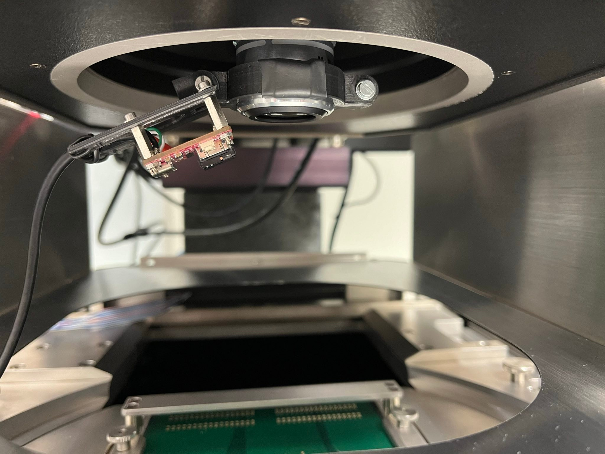

#### 3D-printed design for mounting the PureThermal3 board onto a microscope lens

A simple 3D-printed design for mounting the PureThermal3 board directly on a Mitutoyo microscope lens of 32.2 mm diameter can be found in this folder. This is used for logging the temperatures of ASICs in a wafer proper during the first powering of the chips while connected with a needle probe-card.

The PCB holder part can be rotated around the bracket parts such that the working distance of 34 mm (Mitutoyo M Plan Apo lenses 10x & 5x) is matched.
Elongated mounting holes for the PCB provide further placement flexibility.
 
 Picture of holder attached to retracted Mitutoyo microscope lens inside a SÜSS MicroTech wafer prober:

(USB cable wires have been soldered directly onto the D +/- test pads on the back of the PCB and to the VIN and GND power pins)

#### Files
 - [CAD design file](./camera_holder.blend) for Blender 4, using [CAD Sketcher AddOn](https://makertales.gumroad.com/l/CADsketcher)
 - [lens bracket STL](./camera_holder-lens%20bracket.stl), must printed two times. Put one or two small pieces of shrink-wrap tube around each bracket for best friction.
 - [PCB holder 'hinge' STL](./camera_holder-hinge%20profile.stl) with elongated holes, attachment to lens brackets

 #### Required screws
- 2x M3 screw & 2x M3 nut for closing the bracket, one doubles as rotational axis
- M2 or M2.5 screws or standoff sockets and nuts for fixing the PCB

#### Further Ressources

- a very nice 3D-printed case, enclosing the complete PureThermal board, including a protective slidable cover, can be found from the ever-so-awesome Pierre Muth [here](https://www.printables.com/de/model/303289-pure-thermal-3-case).
- a useful 3D model of a Mitutoyo M Plan Apo lens can be found [here](https://grabcad.com/library/micro-objective-lens-mitutoyo-20x-1). 